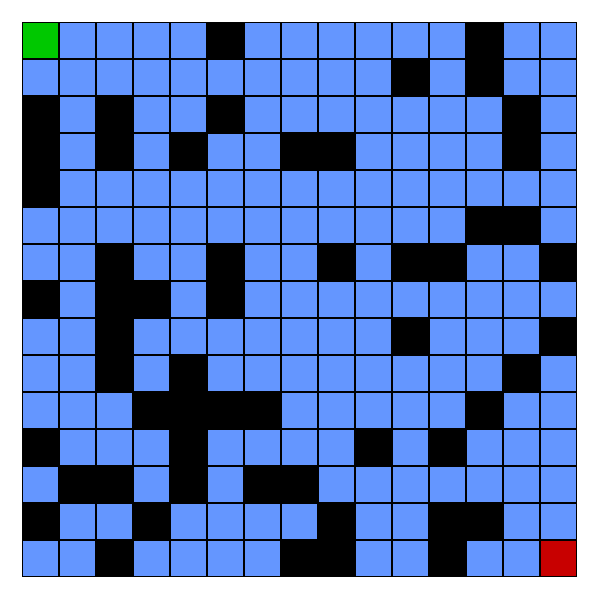
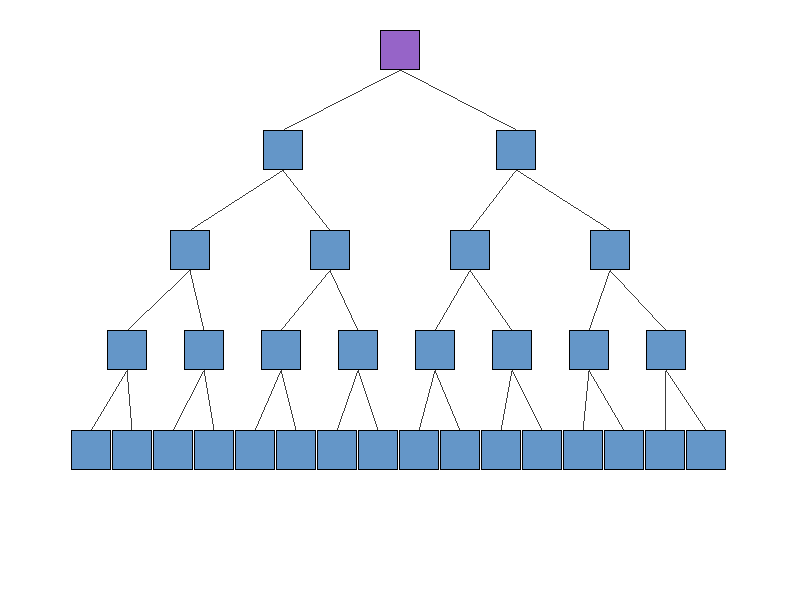

# Data Structures and Algorithms in Rust

A comprehensive Rust implementation of fundamental data structures and algorithms with performance benchmarking and educational GIF visualizations. Explore sorting, searching, pathfinding, and tree traversal algorithms through an interactive menu system.


## 📖 Features

- **🔍 Search Algorithms**: 6 different search techniques with performance analysis
- **📊 Sorting Algorithms**: 13+ sorting algorithms with detailed benchmarking  
- **🗺️ Pathfinding Algorithms**: 5 pathfinding algorithms for grid-based navigation
- **🌲 Tree Traversal Algorithms**: 4 tree traversal methods for hierarchical data
- **📈 Performance Benchmarking**: Detailed timing and operation counting
- **🎬 GIF Visualisations**: Animated algorithm demonstrations


## 🚀 Getting Started

### Prerequisites
- [Rust](https://rustup.rs/) (latest stable version)
- Git for cloning the repository

### Installation
```bash
# Clone the repository
git clone https://github.com/your-username/data-structures-and-algorithms.git
cd data-structures-and-algorithms
```


## 🛠️ Usage Options

### Interactive Menu (Recommended)
```bash
# Run the interactive menu
cargo run

# Or run with release optimisations for benchmarking
cargo run --release
```

### Command Line Interface
```bash
# Sort algorithms with benchmarking
cargo run -- sort --size 1000 --iterations 10

# Search algorithms with benchmarking  
cargo run -- search --words data/words.txt --target "example" --iterations 100

# Pathfinding algorithms with benchmarking
cargo run -- pathfinder --width 20 --height 20 --obstacles 30 --iterations 10
```

## 📚 Available Algorithms

### 🔍 Search Algorithms
`linear`, `binary`, `hash`, `interpolation`, `exponential`, `jump`

### 📊 Sorting Algorithms  
`bubble`, `insertion`, `selection`, `merge`, `quick`, `heap`, `shell`, `tim`, `tree`, `bucket`, `radix`, `counting`, `cube`

### 🗺️ Pathfinding Algorithms
`astar`, `dijkstra`, `bfs`, `dfs`, `greedy`

### 🌲 Tree Traversal Algorithms
`preorder`, `inorder`, `postorder`, `levelorder`

## 📊 Algorithm Complexity Analysis

### 🔍 Search Algorithms Complexity
| Algorithm | Best Case | Average Case | Worst Case | Space | Prerequisite |
|-----------|-----------|--------------|------------|-------|--------------|
| Linear Search | O(1) | O(n) | O(n) | O(1) | None |
| Binary Search | O(1) | O(log n) | O(log n) | O(1) | Sorted data |
| Hash Search | O(1) | O(1) | O(n) | O(n) | Hash table |
| Interpolation Search | O(1) | O(log log n) | O(n) | O(1) | Uniform distribution |
| Exponential Search | O(1) | O(log n) | O(log n) | O(1) | Sorted data |
| Jump Search | O(1) | O(√n) | O(√n) | O(1) | Sorted data |

**🏆 Optimal Choice**: **Hash Search** for O(1) average-case lookup when data structure allows hash tables.

### 📊 Sorting Algorithms Complexity  
| Algorithm | Best Case | Average Case | Worst Case | Space | Stable | In-Place |
|-----------|-----------|--------------|------------|-------|--------|----------|
| Bubble Sort | O(n) | O(n²) | O(n²) | O(1) | ✓ | ✓ |
| Insertion Sort | O(n) | O(n²) | O(n²) | O(1) | ✓ | ✓ |
| Selection Sort | O(n²) | O(n²) | O(n²) | O(1) | ✗ | ✓ |
| Merge Sort | O(n log n) | O(n log n) | O(n log n) | O(n) | ✓ | ✗ |
| Quick Sort | O(n log n) | O(n log n) | O(n²) | O(log n) | ✗ | ✓ |
| Heap Sort | O(n log n) | O(n log n) | O(n log n) | O(1) | ✗ | ✓ |
| Shell Sort | O(n log n) | O(n^1.25) | O(n²) | O(1) | ✗ | ✓ |
| Tim Sort | O(n) | O(n log n) | O(n log n) | O(n) | ✓ | ✗ |
| Tree Sort | O(n log n) | O(n log n) | O(n²) | O(n) | ✓ | ✗ |
| Bucket Sort | O(n + k) | O(n + k) | O(n²) | O(n + k) | ✓ | ✗ |
| Radix Sort | O(d × n) | O(d × n) | O(d × n) | O(n + k) | ✓ | ✗ |
| Counting Sort | O(n + k) | O(n + k) | O(n + k) | O(k) | ✓ | ✗ |
| Cube Sort | O(n log n) | O(n log n) | O(n log n) | O(n) | ✗ | ✗ |

**🏆 Optimal Choice**: **Merge Sort** for guaranteed O(n log n) performance and stability.


### 🗺️ Pathfinding Algorithms Complexity
| Algorithm | Time Complexity | Space Complexity | Optimal Path | Heuristic |
|-----------|-----------------|------------------|--------------|-----------|
| A* (A-Star) | O(b^d) | O(b^d) | ✓ | Required |
| Dijkstra | O((V + E) log V) | O(V) | ✓ | Not used |
| Breadth-First Search | O(V + E) | O(V) | ✓ (unweighted) | Not used |
| Depth-First Search | O(V + E) | O(V) | ✗ | Not used |
| Greedy Best-First | O(b^m) | O(b^m) | ✗ | Required |

*Where V = vertices (grid cells), E = edges (connections), b = branching factor, d = depth of solution, m = maximum depth*

**🏆 Optimal Choice**: **A*** for optimal pathfinding with good performance when using admissible heuristics.



### 🌲 Tree Traversal Algorithms Complexity
| Algorithm | Time Complexity | Space Complexity | Use Case | Order |
|-----------|-----------------|------------------|----------|--------|
| Pre-order (DFS) | O(n) | O(h) | Tree copying, prefix notation | Root → Left → Right |
| In-order (DFS) | O(n) | O(h) | BST sorting, validation | Left → Root → Right |
| Post-order (DFS) | O(n) | O(h) | Tree deletion, postfix notation | Left → Right → Root |
| Level-order (BFS) | O(n) | O(w) | Level processing, serialization | Level by level |

*Where n = number of nodes, h = height of tree, w = maximum width of tree*

**🏆 Optimal Choice**: **In-order traversal** for binary search trees to get sorted sequence.




## 🏗️ Project Architecture

This project follows the **Model-View-Controller (MVC)** pattern for clean separation of concerns:

```
src/
├── main.rs                    # Application entry point
├── controllers/               # MVC Controllers - Business logic
│   ├── app_controller.rs      # Main application flow  
│   ├── search_controller.rs   # Search algorithm coordination
│   ├── sort_controller.rs     # Sorting algorithm coordination
│   ├── pathfinder_controller.rs # Pathfinding coordination
│   └── tree_traversal_controller.rs # Tree traversal coordination
├── views/                     # MVC Views - User interface
│   ├── console.rs             # Console output formatting
│   ├── menu_display.rs        # Interactive menu system
│   └── input_handler.rs       # User input validation
├── models/                    # MVC Models - Data structures  
│   ├── config.rs              # Configuration structures
│   └── menu_choice.rs         # Menu choice enums
├── gui/                       # GIF visualization system
│   ├── sorting.rs             # Sorting visualizations
│   ├── pathfinder.rs          # Pathfinding visualizations
│   ├── tree_traversal.rs      # Tree traversal visualizations
│   └── renderer.rs            # Frame rendering utilities
└── [algorithm_type]/          # Algorithm implementations
    ├── mod.rs                 # Coordinator and benchmarking
    └── *.rs                   # Individual algorithm files
```
